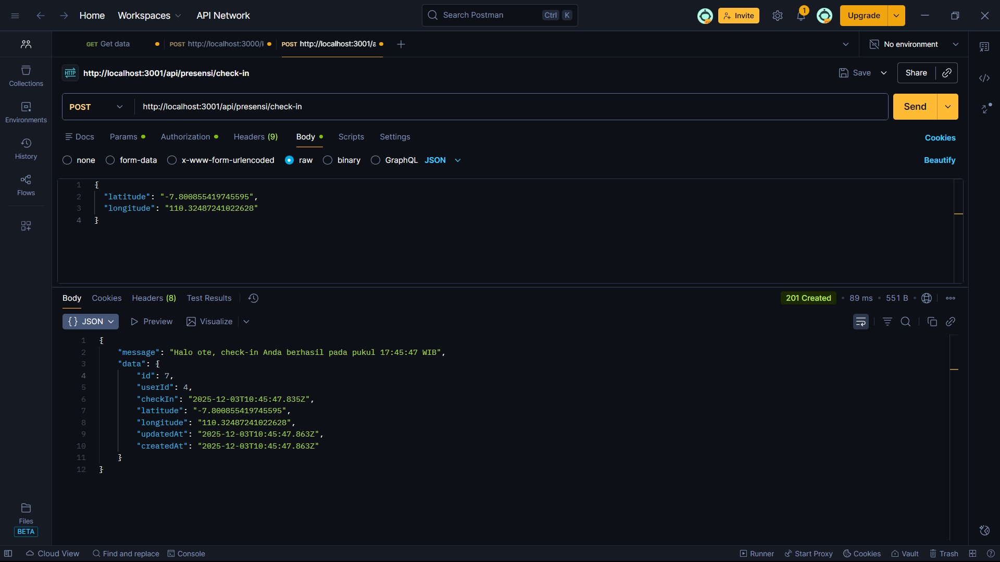
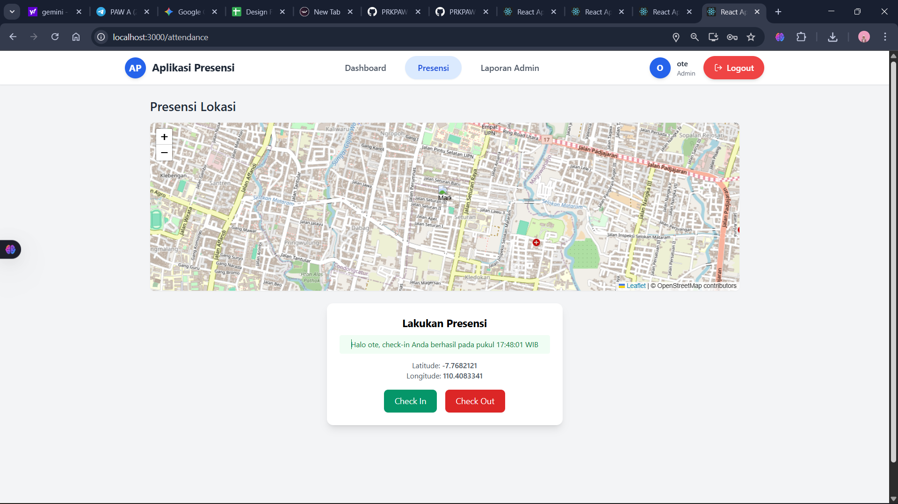
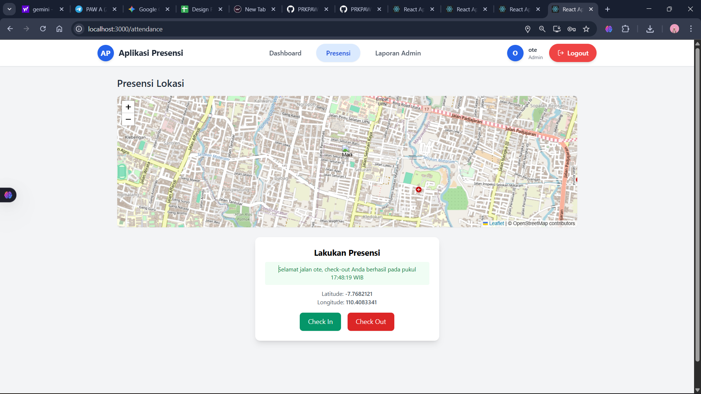
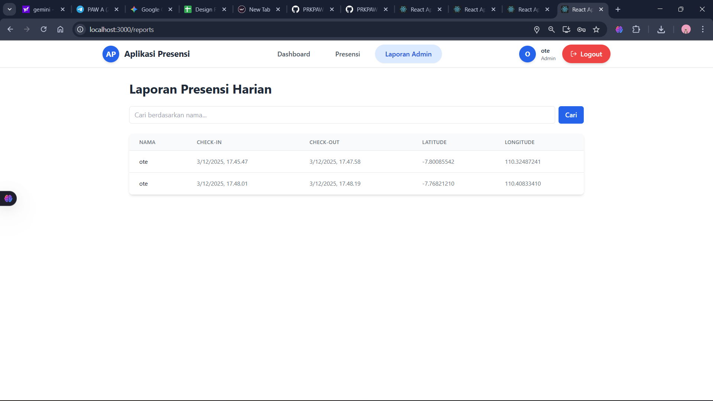
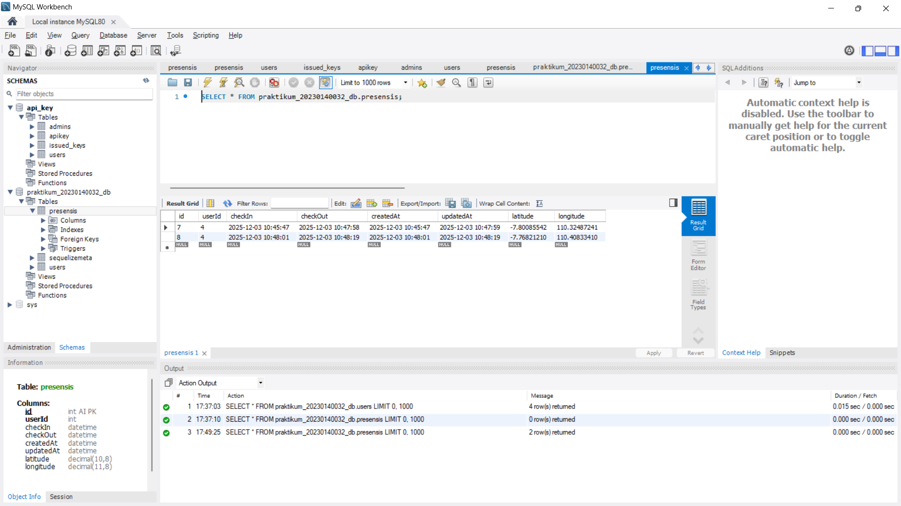

# Tugas 9

1. Tampilan  presensi/check-in dengan menggunakan bearer token dan body latitude, longitude 

2. Tampilan Check-in dengan menampilkan maps OSM

3. Tampilan check-out dengan menampilkan maps OSM

4. Tampilan Endpoint Report Admin

5. Tampilan Database Presensi

